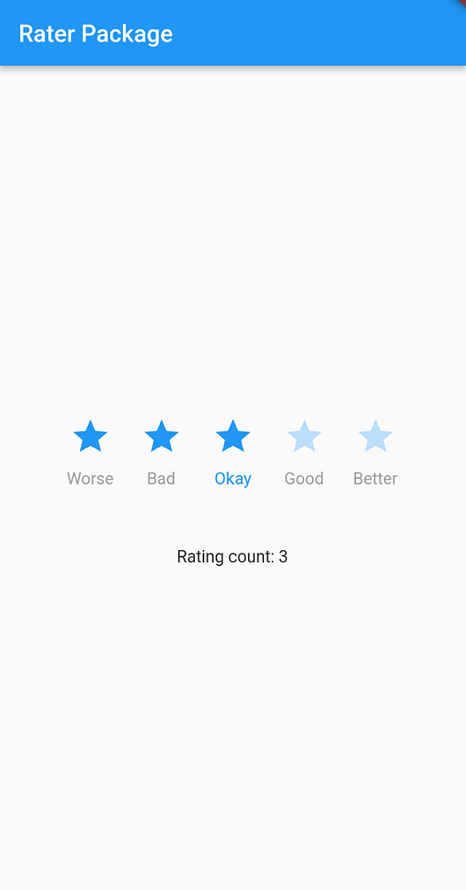

<!--
This README describes the package. If you publish this package to pub.dev,
this README's contents appear on the landing page for your package.

For information about how to write a good package README, see the guide for
[writing package pages](https://dart.dev/guides/libraries/writing-package-pages).

For general information about developing packages, see the Dart guide for
[creating packages](https://dart.dev/guides/libraries/create-library-packages)
and the Flutter guide for
[developing packages and plugins](https://flutter.dev/developing-packages).
-->

A dart package for rating widget which is easy to implement and customize.

## Features

1. Set IconData available in inbuilt Icon class.
2. Supports vertical layout.
3. Set customizable lables for each rating accordingly.



```dart
Rating({
    super.key,
    required this.onChangeRating,
    this.lables,
    this.entityWidth = 40.0,
    this.initialRating = -1,
    this.enableLable = false,
    this.iconData = Icons.star,
    this.direction = Axis.horizontal,
    this.activeColor = Colors.amber,
    this.inActiveColor = Colors.grey,
    this.rateOutOf = 5,
    this.iconSize = 30.0,
    this.entityPadding = const EdgeInsets.symmetric(horizontal: 5.0),
    this.activeLableStyle = const TextStyle(
      color: Colors.amber,
    ),
    this.inActiveLableStyle = const TextStyle(
      color: Colors.grey,
    ),
    this.verticalLabelSpace = 0.0,
  });
```

## Usage

### Import the package 
To use this plugin, follow the [plugin installation instructions](https://pub.dev/packages/google_sign_in/install).

### Use the package 
Add the following import to your Dart code:
```dart
import 'package:rater/rater.dart';
```
You can use Rater class now, to add rating widget.

```dart
        Rater(
              onChangeRating: (rating) {
               print(rating);
              },
              activeColor: Colors.blue,
              inActiveColor: Colors.blue.shade100,
              direction: Axis.horizontal,
              lables: ["Worse", "Bad", "Okay", "Good", "Better"],
              enableLable: true,
              iconSize: 35,
              rateOutOf: 5,
              iconData: Icons.star,
              initialRating: 4,
              activeLableStyle: TextStyle(color: Colors.blue),
              inActiveLableStyle: TextStyle(color: Colors.grey),
              entityPadding: EdgeInsets.symmetric(horizontal: 10),
              entityWidth: 40,
              verticalLabelSpace: 10,
            ),
```

## Additional information

Feel Free to request any missing features or report issues [here](https://github.com/DarshanVanol/Rater_package/issues).

## Licence
```
Copyright © 2023 Darshan Vanol

Redistribution and use in source and binary forms, with or without modification, are permitted provided that the following conditions are met:

1. Redistributions of source code must retain the above copyright notice, this list of conditions and the following disclaimer.

2. Redistributions in binary form must reproduce the above copyright notice, this list of conditions and the following disclaimer in the documentation and/or other materials provided with the distribution.

3. Neither the name of the copyright holder nor the names of its contributors may be used to endorse or promote products derived from this software without specific prior written permission.

THIS SOFTWARE IS PROVIDED BY THE COPYRIGHT HOLDERS AND CONTRIBUTORS “AS IS” AND ANY EXPRESS OR IMPLIED WARRANTIES, INCLUDING, BUT NOT LIMITED TO, THE IMPLIED WARRANTIES OF MERCHANTABILITY AND FITNESS FOR A PARTICULAR PURPOSE ARE DISCLAIMED. IN NO EVENT SHALL THE COPYRIGHT HOLDER OR CONTRIBUTORS BE LIABLE FOR ANY DIRECT, INDIRECT, INCIDENTAL, SPECIAL, EXEMPLARY, OR CONSEQUENTIAL DAMAGES (INCLUDING, BUT NOT LIMITED TO, PROCUREMENT OF SUBSTITUTE GOODS OR SERVICES; LOSS OF USE, DATA, OR PROFITS; OR BUSINESS INTERRUPTION) HOWEVER CAUSED AND ON ANY THEORY OF LIABILITY, WHETHER IN CONTRACT, STRICT LIABILITY, OR TORT (INCLUDING NEGLIGENCE OR OTHERWISE) ARISING IN ANY WAY OUT OF THE USE OF THIS SOFTWARE, EVEN IF ADVISED OF THE POSSIBILITY OF SUCH DAMAGE.
```
